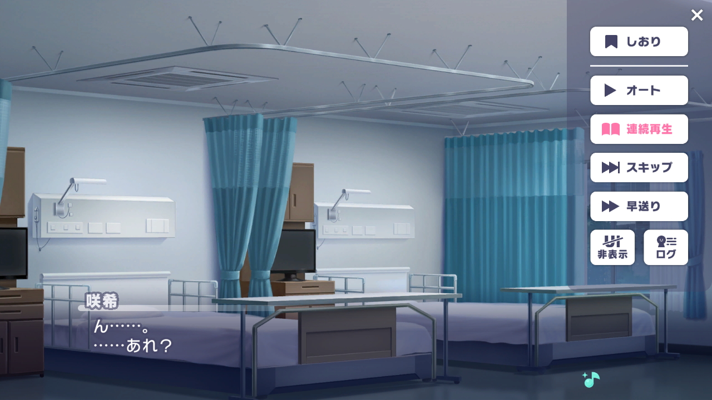
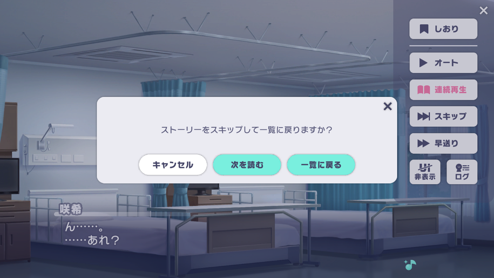

# 开发指南
以下开发指南适用于有 Python 基础的人，尤其是熟悉游戏自动化（如 Alas、MAA、MaaFramework、baas 等）编写逻辑的人。
务必完整阅读后再开始编写代码。

## 项目结构
* kotonebot/kaa/config：配置文件
    * /schema.py：通用配置
    * /produce.py：培育相关配置
    * /migration：配置迁移代码
* kotonebot/kaa/tasks：任务代码
    * /produce：培育相关代码
    * /daily：日常相关代码
* kotonebot/kaa/main：程序入口
* kotonebot-resource/sprites/jp：图片资源

## 代码风格
1. 所有代码都建议要有 typing hint（可以自动推导出来的可不写），特别是函数与类定义。
2. 即便自动推导正确，函数返回值也必须显式指定类型，除非返回值不使用/无意义。
3. 新编写的代码必须能够通过 Pylance/Pyright 在 basic 等级下的类型检查。对于难以解决的类型问题，可以用 `# type: ignore` 忽略。
4. Git commit message 采用 Angular 风格。消息主题用一句话描述修改内容。scope 可选择：task、core、ui、launcher（旧写法为 bootstrap）。
5. 对枚举或 Literal 进行判断时，尽量使用 match + assert_never 的写法，而不是 if-elif-else。
```python
match value:
    case MyEnum.A:
        ...
    case MyEnum.B:
        ...
    case _:
        assert_never(value) # 如果漏掉一种情况，在类型检查时这里会报错
```

## 任务定义
kotonebot 框架定义了 @task 与 @action 两个函数装饰器，用于定义任务与行动。Task 名称统一用中文，将会展示在 UI 上，因此越简洁越好。Action 名称可选，目前没有统一要求，也没有任何作用。

```python
from kotonebot import task, action

@task('任务名称', screenshot_mode='manual-inherit')
def my_task():
    ...

@action('行动名称', screenshot_mode='manual-inherit')
def my_action():
    ...
```

`screenshot_mode` 参数决定了截图方式是自动还是手动。可选值：
```python
ScreenshotMode = Literal['auto', 'manual', 'manual-inherit']
```

kaa 早期代码都采用自动模式 `auto`，每次找图、OCR 都会自动更新截图。后来发现这样在低速设备上会严重拖慢运行速度，因此新代码一律改用手动模式 `manual-inherit`。

考虑到兼容性，`screenshot_mode` 参数可选，默认为 `auto`。

## 代码模式
对于手动模式，一种常见的模式是循环：
```python
from kotonebot import device, image, Loop

for _ in Loop():
    if image.find(A):
        device.click()
    elif image.find(B):
        device.click(image.expect(C))
    elif image.find(D):
        break
```
至于为什么要用循环，参见 Alas 文档 [State Loop](https://github.com/LmeSzinc/AzurLaneAutoScript/wiki/4.4.-State-loop)（强烈建议你先阅读这篇文档后再继续往下看）。

不过不同于 Alas，kaa 并不使用裸 `while True`，而是封装了一个 Loop 类。Loop 类会自动处理截图、延时、用户手动暂停与停止（以及尚未实现的全局处理）等问题。如果你的循环代码只是普通的循环，不涉及设备操作、识图等，按照原有写法即可，不需要用 Loop 类。

### 陷阱
使用循环写法有一些常见陷阱。
从 click-wait-click 模式转向循环模式时，有一个隐含的状态「代码执行顺序」会丢失。下面这些陷阱大多都是由于丢失了这个状态导致的。

#### 1
现在需要点击图一中的跳过按钮「スキップ」，然后点击图二中的阅读下一个按钮「次を読む」，完成刷剧情这一动作。

<table>
    <tr>
        <th><center>图一</center></th>
        <th><center>图二</center></th>
    </tr>
    <tr>
        <td></td>
        <td></td>
    </tr>
</table>

不难写出下面的代码：
```python
for _ in Loop():
    if image.find(R.Story.ButtonSkip):
        device.click()
    elif image.find(R.Story.ButtonReadNext):
        device.click()
```
如果实际执行代码，你会发现脚本在一直点击跳过按钮，哪怕已经弹出了图二的弹窗，也还是在点击跳过按钮。为什么？仔细观察图一图二，其实**屏幕右侧的跳过按钮总是存在**，导致总是命中第一条 if，点击跳过按钮。

如果采用 click-wait-click 模式，则不会有这个问题：
```python
device.click(image.expect_wait(R.Story.ButtonSkip))
device.click(image.expect_wait(R.Story.ButtonReadNext))
```
因为点击了「跳过」按钮后就不会再去检测「跳过」按钮了，只会检测「阅读下一个」按钮。采用而循环模式时，代码执行顺序丢失了，你无法保证两个 image.find 的命中顺序恰巧就是你预期的顺序。

解决方法很简单，只需要调换二者的顺序：
```python
for _ in Loop():
    if image.find(R.Story.ButtonReadNext):
        device.click()
    elif image.find(R.Story.ButtonSkip):
        device.click()
```
这样就可以解决上面的问题。

此类问题大多可以通过调换顺序解决，**一般情况下检测顺序是出现顺序的逆序**（也就是倒过来写）。

#### 2
// 待补充

## API
API 分两层：Library 层与 Framework 层。

Library 层，独立使用，需要自行传入截图数据。一般不需要使用这一层的 API。
```python
from kotonebot.backend.image import find # ...
from kotonebot.backend.ocr import find # ...
from kotonebot.backend.color import find # ...

find(image_data, ...)
```

Framework 层，与框架等其他部分整合，不需要自行传入截图数据。Framework 层大多只能在 Task 或 Action 函数中调用，在其他地方调用会报错（因为缺少截图数据）。
```python
from kotonebot import device, image, ocr

@action # 自动模式
def foo():
    image.find(...)

@action(screenshot_mode='manual') # 手动模式
def foo():
    device.screenshot() # 需要显式调用截图
    image.find(...)

    # 截图函数会返回截图数据，但是一般情况下不需要接受
    img = device.screenshot()
```

常见 API 如下：
```python
# device
def click(x: int, y: int): ...
def click(pt: Point): ...
def click(clickable: ClickableObjectProtocol):
    ...
    # image 与 ocr 中 find_xxx 返回的结果一般都为 ClickableObjectProtocol
def click():
    ...
    # 点击上次寻找结果
    # 一般与 if 结合使用：
    if image.find(...):
       device.click() 
def click_center(): ...
def double_click(x: int, y: int, interval: float = ...): ...
def double_click(rect: Rect, interval: float = ...):
    ...
    # 随机点击区域中的某个点
def double_click(, interval: float = ...): ...


# image
# （由于参数过长，这里只列出常见参数，完整参数参阅对应函数的 doctstring）
# （命名参数基本一致，因此只在第一个函数中列出）
def find(template, *, threshold: float = ..., colored: bool = ...): ...
def find_all(template): ... # 寻找某个模版，返回所有结果
def find_mutil(templates: list): ... # 寻找多个模版，返回第一个找到的结果
def find_all_mutil(templates: list): ... # 寻找多个模版，返回所有找到的结果
def wait_for(template, *, timeout: float  =...): ... # 同 find，但是会重复寻找直到成功或超时
def expect(template): ... # 同 find，但是未找到时抛出异常
def expect_wait(template): ... # 同 wait_for，但是未找到时抛出异常


# ocr
# （命名参数基本一致，因此只在第一个函数中列出）
def ocr(*, rect, lang): ... # OCR 指定范围，返回所有结果
def find(pattern):
    ...
    # 寻找第一个满足要求的 OCR 结果
    # pattern 可选：
    from kotonebot import regex, contains, equals, fuzz
    # 例
    ocr.find(regex('\\d+'))
def find_all(pattern): ... # 同 find，但是返回所有满足要求的结果
# 下面的类似 image，不再赘述
def expect(pattern): ...
def expect_wait(pattern): ...
def wait_for(pattern): ...
```

【注意】如无必要不使用 OCR。对于固定的文字，尽量使用模版匹配代替。

### 资源
// TODO
<!--
资源分为模版图片与固定坐标两种。kaa 专门开发了工具来管理这两种资源。下面介绍如何新增资源。

首先你需要拿到设备原始截图，一般通过模拟器自带的截图功能就能拿到（不建议使用 DMM 版来获得截图数据）。为这个截图起一个合适的名称，一般以 `screenshot_` 开头，简单描述图片。对于同一操作的连续截图，可以用加数字编号，避免文件名过长。
-->

### 配置修改
如果你需要新增配置项，直接在 `kotonebot/kaa/config` 下修改对应文件即可。

对于新增配置，不需要编写迁移代码，也不需要提高配置版本号。但是如果你修改了现有配置的格式，则需要执行这两项任务。

### UI
配置对应的 UI 代码是手动编写的。目前 UI 代码十分杂乱，且后期计划彻底重构并迁移至其他 UI 库，因此 UI 代码这一部分并没有什么风格或编写上的要求，只要能正确运行即可。

### 调试
如果需要调试模版匹配、OCR 等结果，可以开启「保留截图数据」。开启后会将所有识别结果保存在 `./dumps` 文件夹下。执行：
```
just devtool
```
启动开发工具，载入刚刚的文件夹，即可查阅所有的识别结果。

「保留截图数据」也可通过代码开启：
```python
from kotonebot.backend.debug import debug
debug.auto_save_to_folder = 'dumps'
debug.enabled = True
```
你可以把这段代码放到模块的 `__main__` 里，用于临时调试。